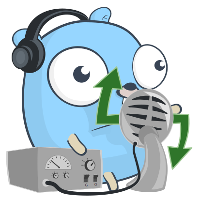

# Go gRPC-Web Example
[](https://circleci.com/gh/johanbrandhorst/grpcweb-example)
[](https://goreportcard.com/report/github.com/johanbrandhorst/grpcweb-example)
[](https://godoc.org/github.com/johanbrandhorst/grpcweb-example)



An example implementation of a
[GopherJS React](https://myitcv.io/react)
client talking to a Go gRPC server using the Improbable gRPC-Web client implementation and proxy through the
[protoc-gen-gopherjs](https://github.com/johanbrandhorst/protobuf/tree/master/protoc-gen-gopherjs)
bindings generator.

## Developing
To run the server on `https://localhost:10000`:

```
$ go run main.go
```

Then you'll need to also install some vendored generators:

```
$ make install
```

After that, any changes you make to the proto file in `./proto/` or the JS client code
in `./client/` should be followed by

```
$ make regenerate
```

You may need to generate the client code twice as the first time will run `reactGen` and
`immutableGen` which might be necessary for the subsequent `gopherjs build` to work.
